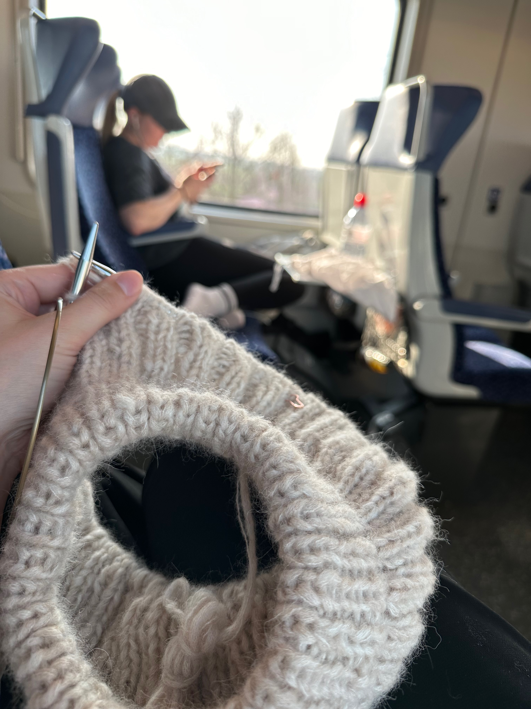
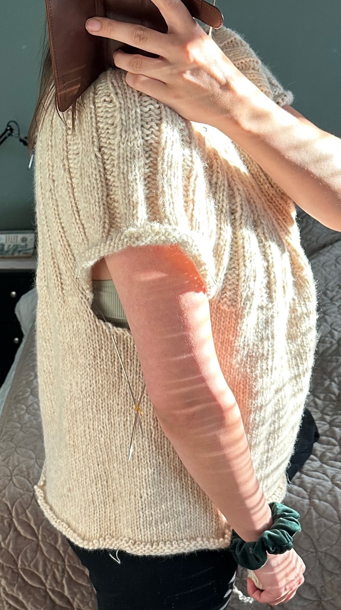
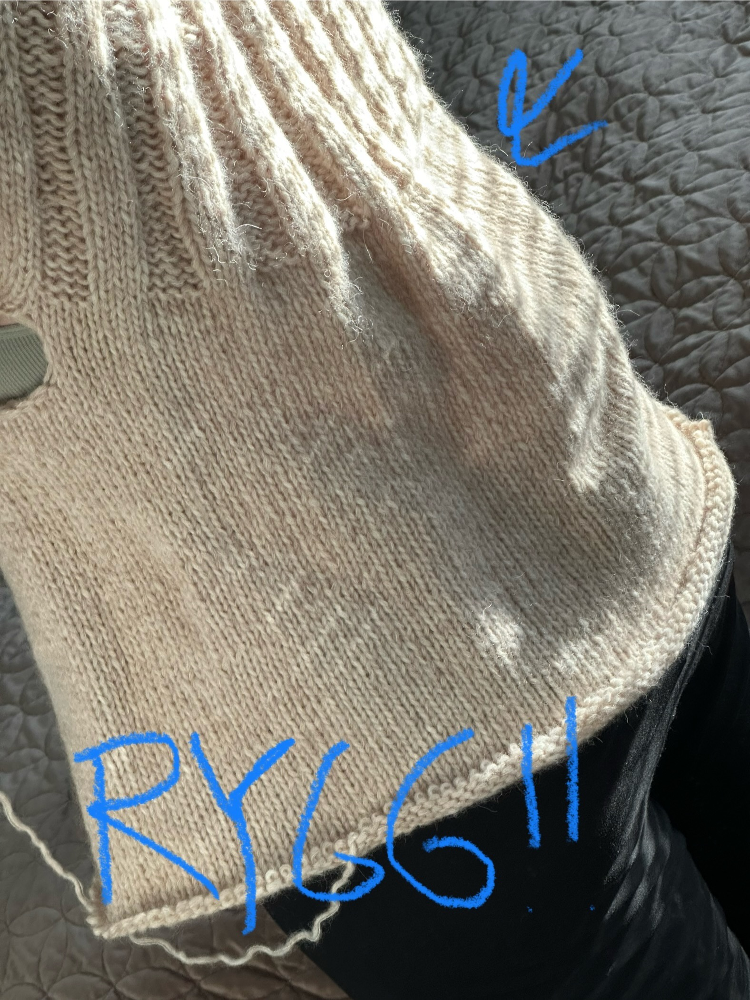
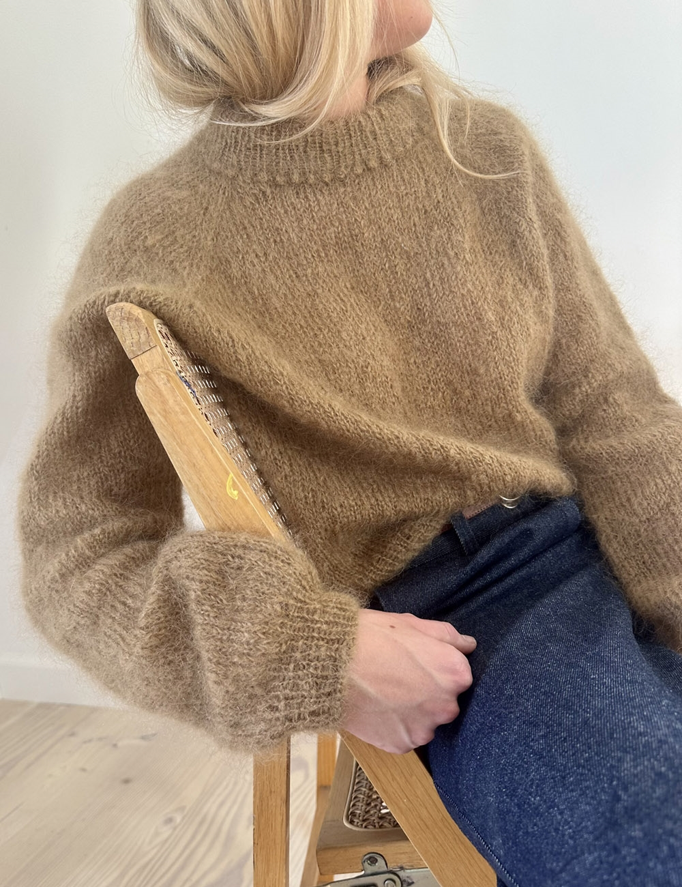
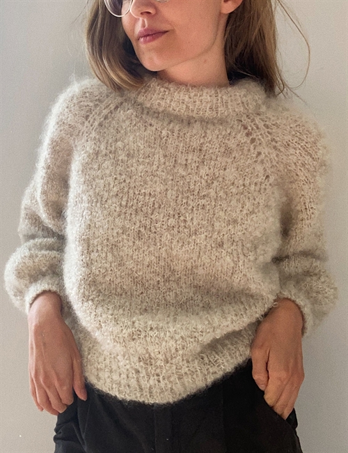
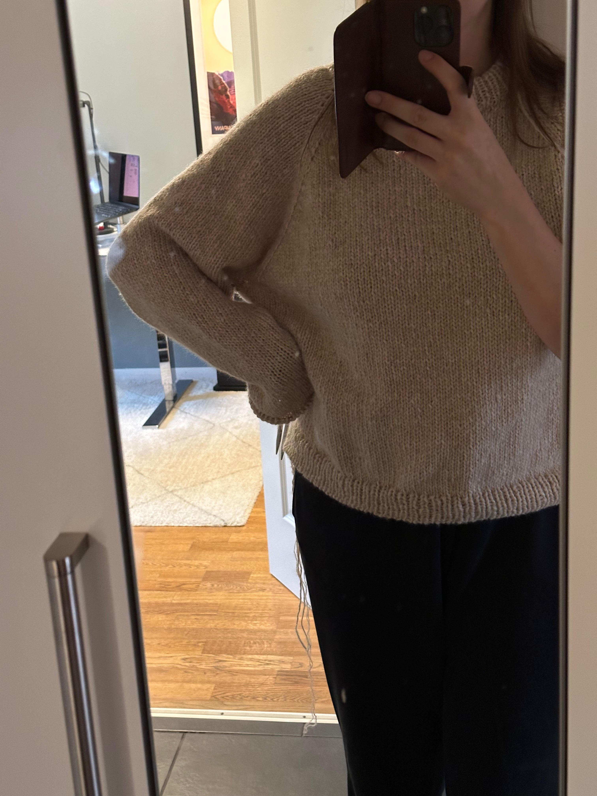
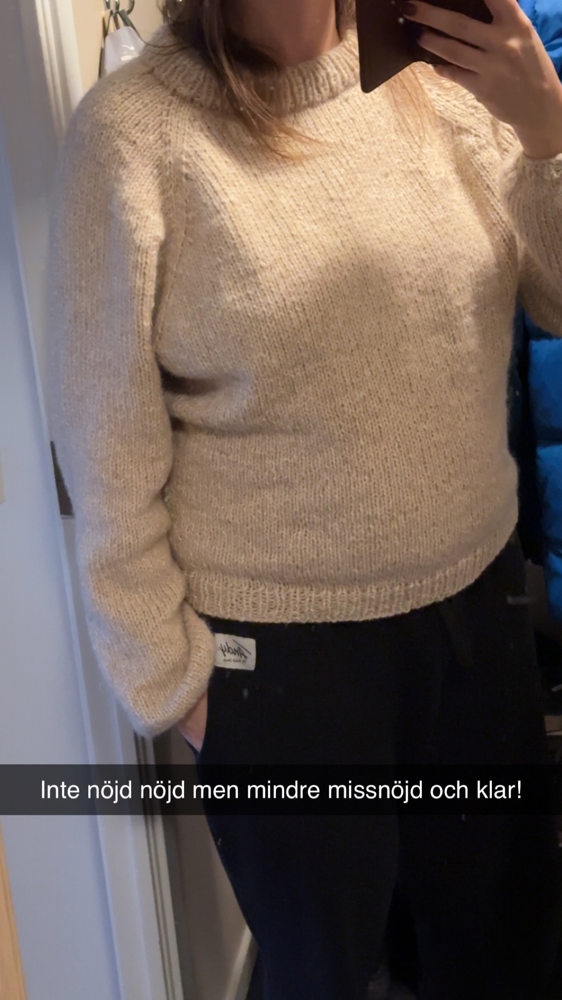
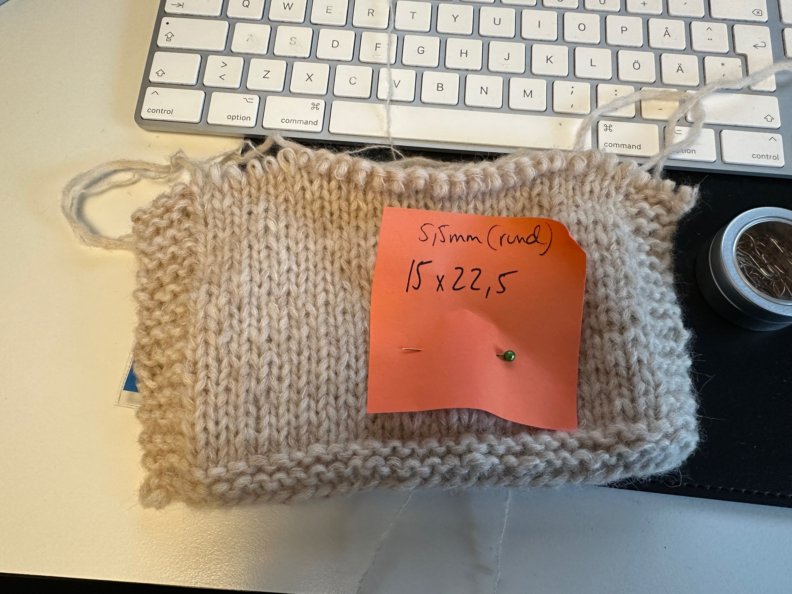

Detta projekt alltså, misslyckanden och missnöjdhet omlott och återkommande.

Började nog med att jag såg att Alona gjort en så fin tröja, en Sunday Sweater ([ravelry-länk till hennes projekt](https://www.ravelry.com/projects/alonat/sunday-sweater)):


Och då ville jag göra en likadan! Hade fått presentkort när jag bytte jobb så åkte och köpte garn och körde igång mars 2024.


Jag hade gjort en provlapp och detta var mina anteckningar:

```
Ska vara 14x20

Provlapp
Före blockning 14 maskor 19 varv

Blockning blöt ej sträckt
13 maskor 19 och kanske en halv

Om man får FÄRRE betyder det att tröjan blir STÖRRE
```

Typ 23 april inser jag att jag stickat för långt, och troligen för stor storlek. Hoppet mellan L och XL och uppåt är dubbelt så stort som mellan de mindre storlekar, är det standard????

```
Har typ 30 cm positive ease vid naveln, eller upp till 30cm för mycket.
```

24 maj river jag upp denna i XL för den är för stor:

```
Tror dels att formen inte passar mig men kanske skulle funka i M eller L. Problemet är nog primärt ryggen och sekundärt att det blir bylsigt från bröst och neråt. Tycker det är en riktigt stor omkrets, så borde kunna gå ner t M tror jag. 

Med bröstet så tror jag det påverkar att den går för långt ner förbi brösten jmf m bilderna på petite knits hemsida, där slutar den på övre delen av bröstet men på mig slutar den under bröstet, liggande är ribbningen på min tröja 26cm (exkl halskrage), vilket är enligt mönster.

Svårt att veta vad jag kan göra för att det ska bli bra. Med ledordet är MINDRE. För allt känns för stort nu (utom ev kragen, den känns toppen)
```

Jag är besviken över att det buktar ut både fram och bak där ribbningen tar slut, såhär i efterhand undrar jag om det hade löst sig med blockning? Men den är ju oavsett stor jämfört med Alonas ...right?



Nu i februari 2025 är jag lite sugen på att försöka igen, med kanske M eftersom denna blev jättestor och stickfastheten indikerar att jag borde gå ner i storlek. Iof var jag on gauge? `Tröjan är lite över 120cm i omkrets i slätstickningen.` jag skriver också `Kanske kan kolla på en tröja jag gillar och se vad den har för omkrets? Nelly är typ lika bred (lite bredare faktiskt) men den har ju ett annat fall pga tunnare…`

Oklart hur siffrorna går ihop. För mitt bröstmått är typ 100cm, och jag säger att tröjan är 120cm i omkrets (vilket stämmer överens med mönstret) men att jag har 30 cm positive ease? Rek positive ease är dock 10-15 cm så oavsett är det ju stort.

(Skriver senare i Picot sweater-projektet att "Sunday sweater är sååå stor i 126cm bredd", så kanske inte var on gauge ändå?)

Men nu fastnade jag i detta, för jag blir lite sugen på att försöka igen och då behöver jag ju förstå vad som behöver korrigeras.

Efter att jag rivit upp så började jag researcha vad jag skulle kunna göra istället, landade i [Le Knits Picot Sweater](https://leknit.com/shop/picot-sweater-svenska-873p.html) (men utan knopparna på halsen).




```
Köpte mönstret 29/4 2024 efter mycket velande om vad jag skulle göra. 

Söker egentligen looken av le Knits boucle sweater, men ville inte ha sådana hål i raglan och den var bottom up vilken inte kändes så kul nu när jag är osäker redan på top down. Ville också ha shortrows för halsen. Close enough. 

Min stackfasthet är 14x21 på 7cmstickor så får korrigera.

Iom att mönstret är 15 maskor och 23 så kommer min bli större.  
```

[Le Knit Bouclé Sweater](https://leknit.com/shop/boucle-sweater-svenska-492p.html)



Jag räknar på det:

```
Jag tror M blir bra. För då blir det 13cm övervidd ung men tröjan kommer bli lite större pga stickfasthet
```

Jag kör väl igång och när jag kommit långt så inser jag att jag inte alls är nöjd, att den är så himla stor. Minns inte ordningen, men i november har jag "projekt ärmar" där jag väljer att hitta på något eget, kanske mer likt Alonas Sunday sweater-ärmar? Såhär gjorde jag  

```
Ett varv av bara knit2tog, så antalet makor halverades. Nästa varv bytte jag till 4,5mm-strumpstickor och började med k1p1-ribb. Typ 4 varv ribb sen ett varv ribb med 4 k2tog-minskningar någorlunda jämnt fördelat. Sen en stram avmaskning: https://www.garnstudio.com/lesson.php?id=7&cid=12 
```

Men efter det är jag inte nöjd med kroppen heller, efter att ha gjort italian bindoff så är jag missnöjd med hur mudden på kroppen ser ut, den är liksom bucklig? och otight? Går utåt istället för inåt!   



Jag gillar inte heller att den är så himla bred, se under armen! Så har långt velande nu, där Hanna och Linn tycker den är fin men att jag ska riva upp om det är så att jag själv inte är nöjd.

Eftersom jag inte är nöjd så river jag till slut upp nästan hela vägen till där ärmarna börjar, vill ta bort 32 maskor och ska göra det med minskningar. Verkar också vilja göra den längre, men garnet tog precis slut med ärmarna (hade redan köpt till mer garn två gånger tror jag, en för sunday och en för picot?). Så hoppas att dessa minskningar ska resultera i tillräckligt mycket mer längd.

```
7 dec 2024: minskade 4 på ett varv var tredje varv, totalt 8 gånger = 16 maskor mindre per sida = 32 maskor mindre totalt
```

Och sen är jag osäker på mudden, hade jag verkligen bytt till 6mm i första versionen? Eftersom mudden gick ut istället för in? 

`23 dec 2024: avslutade med mudd på 5,5mm-stickor och sen italian bindoff`

Såhär såg denna andra version av tröjan ut:



Här är jag ju 7 månader gravid dessutom, så den är ju tightare runt midjan här än vad den vanligtvis skulle vara, vilket gjorde det ännu svårare att bedöma nöjdhet.

Tycker INTE om att det bucklar ut så mycket under axeln, har jag verkligen så smala armar att alla mönster ska bli såhär?

Tycker INTE om att när jag håller upp armarna så ser man tydligt att det ju är gjort minskningar runt kroppen.

Kanske skulle jag bara ha gjort om själva mudden på första versionen?

Och allmänt: är jag inte nöjd för att jag gjort något fel? Eller för att mönstret inte passar mig? Eller för att garnet är väldigt annorlunda?

7 dec 2024 hittar jag en gammal provlapp med snefnug+midnatsol på 5,5mm  som tydligen blir 15x22,5 (oblockat antar jag). När är denna från?



Det betyder ju att jag borde använt 5,5mm-stickor? Men det gjorde jag ju inte? 

Och varför skriver jag `14x21 på 7cmstickor så får korrigera` om jag kommer så nära gauge på 5,5mm? Är 14x21 från Sunday Sweater och att jag "hittar rätt" på 5,5mm men glömmer skriva upp det? Och därför kör 6+7mm på picot ändå?

Har jag under stickningens gång glömt bort vilka stickor jag borde använda? Skrivit fel på provlappen? Räknat fel?

Ja, jag är ju inte nöjd iaf, har använt tröjan litegrann, men senaste dagarna har jag börjat tänka att jag borde riva upp igen. Göra en mindre storlek av antingen Sunday eller Picot sweater, eller något helt annat potentiellt. Eftersom jag inte är nöjd med resultatet. Borde dock mäta mäta mäta stickfastheten på denna. OCH BLOCKA? Kanske hade mudden på variant 1 löst sig om jag blockat? Har vad jag kan minnas inte blött ner denna en enda gång under något av projekten? Kanske börja med det innan jag mäter innan jag river upp... Eller jo jag steamade mittenpartiet på kroppen, kanten där jag började sticka igen efter att ha rivit upp. För det blev som en kant, steamningen fick bort kanten. Men var kanten för att jag faktiskt hade olika stickstorlek uppe och nere? nääää?

Ja ett härke har det varit, och mer härke vill jag tydligen ha genom att riva upp? Wish me luck 🙃

Garn: CaMaRose Snefnug (7314 Ljusbeige) och CaMaRose Midnatssol (9506 Ljusbeige)
