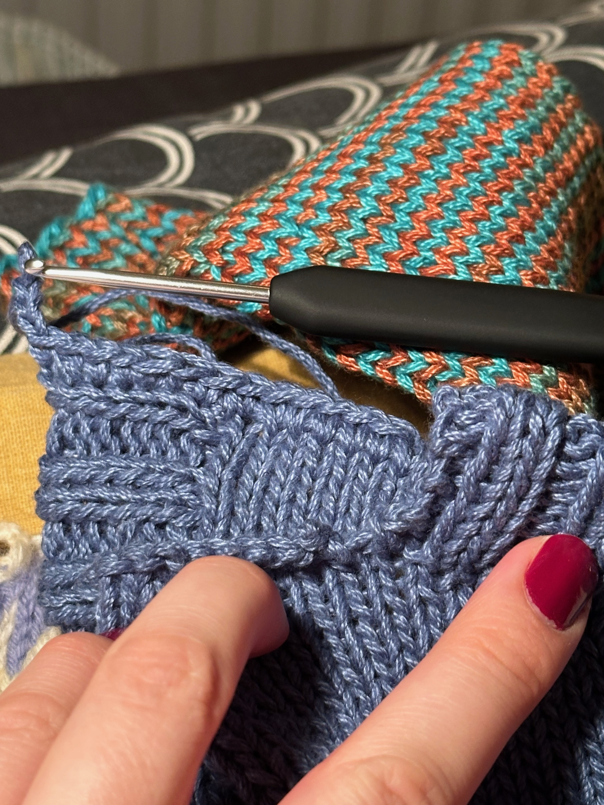
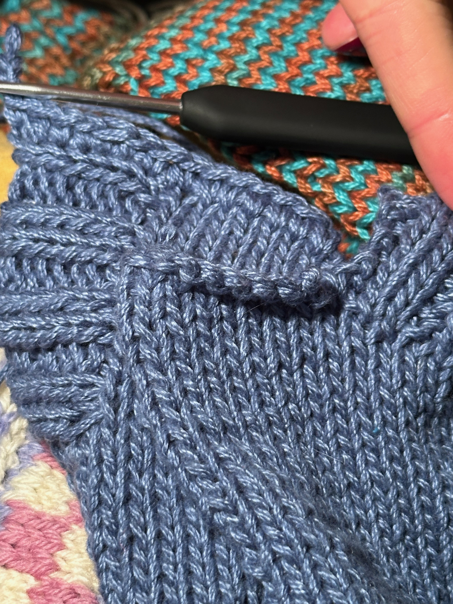
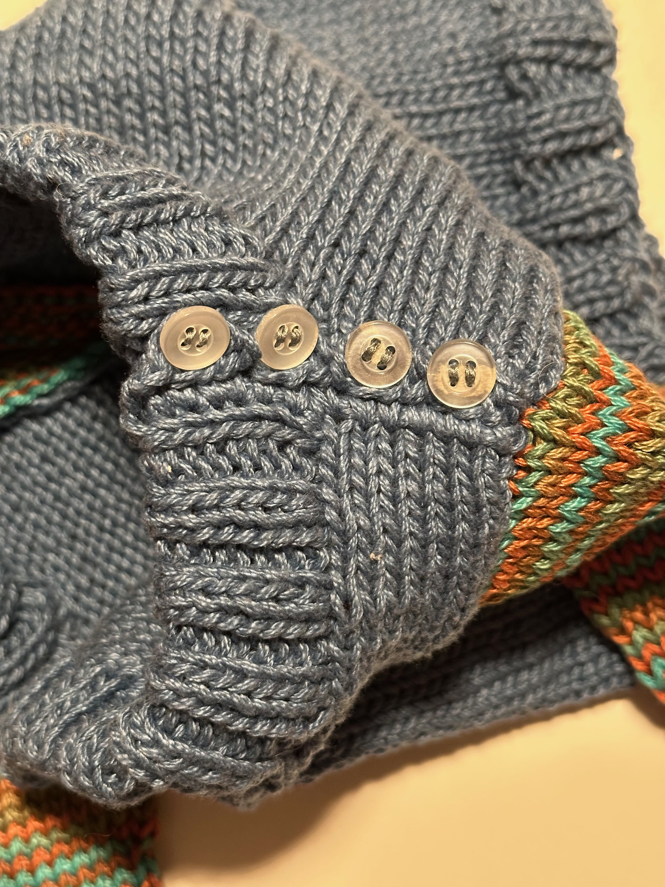
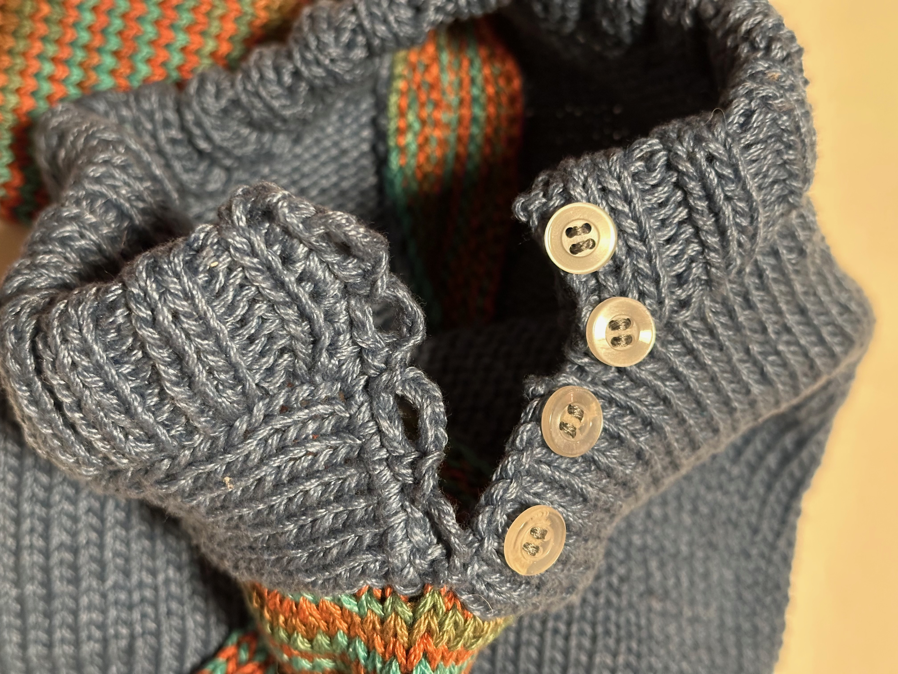

Baby knit!

Fick massor av garn av Ulla som jag inte visste vad jag skulle göra av, så började göra en bebiströja.

Stickade först kroppen nerifrån och upp, när jag tänkte det var dags för ärmar så gick jag över till fram och tillbaka, 
fick fokusera på att hålla spänningen för att de aviga raderna inte skulle bli slappa. Antar att jag maskade av för att
förbereda formen på halsringningen, för resåren gjordes senare. 

Fick alltså pausa kroppen för att göra ärmarna för att veta hur mycket plats som skulle behövas. Längd på både kropp 
och ärmar är rätt godtycklig utifrån diverse inköpta bebiströjor i olika storlekar och stil/design. 
Kanske blev kort och ärmarna långa men smala? Ärmarna stickades från mudd och upp med 2 ökningar varannan cm fr 1,5 cm efter mudd.

Ribb nere är på 3mm, oklart om halsringning är 3 eller 3,5mm men kroppen och hela ärmarna inkl mudd är 3,5mm. All
ribbstickning är k2p2.

 
 
 

Nu blev halsringningen större än jag planerat så knapparna behövs kanske inte. Men jag såg denna knapplösning
på en hemmastickad tröja jag köpte på Vinted så jag försökte replikera den konstruktionen, 
den hade knappar upp på den ribbade kanten och virkade knapphål precis som denna.

(Ungefär) såhär monterade jag tröjan 

1. Sydde ihop axeln utan knappar (gissningsvis samma metod som för att sy fast ärmarna)
2. Ta upp maskor för halsringning och sticka den, sen antar jag att den syddes ner.
3. Virka knapphål och sy fast knapparna

Ärmarna sattes fast någorlunda som i denna video: https://youtu.be/urOn3DSHBlc?si=zzjqxu3O9n4AMDRR 
oklart när det gjordes, men kääääänns som det borde varit sist? För att matcha hur det blev med knapparna?

Vet inte riktigt vad jag hade gjort annorlunda om jag gjort om, kanske främst måtten? Konstruktionen blev ju ändå bra 
till slut? Får se när bebis kommer om halsen blev för stor eller bra. Kanske göra halsen lite mer rund istället 
för fyrkantig? 

Mest nöjd med att jag fick ihop det efter olika utmaningar och huvudbry, nöjd med knappraden!

Garn: Okänt bomull

Mönster: Eget hittepå

Ravelry Projekt: [Blå bebiströja 2024](https://www.ravelry.com/projects/amandasjostrom/bla-barntroja-2024)