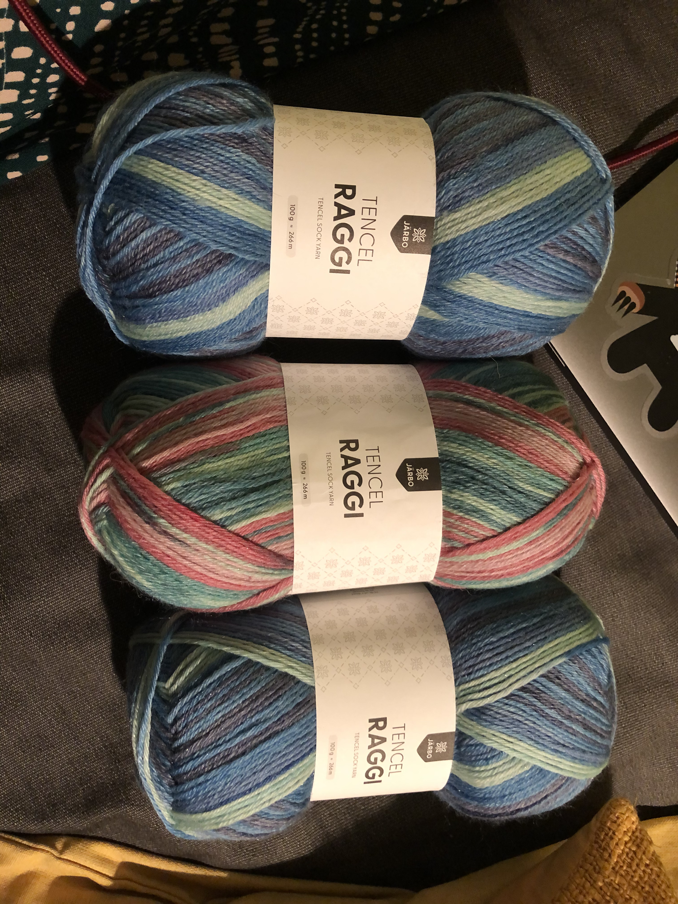
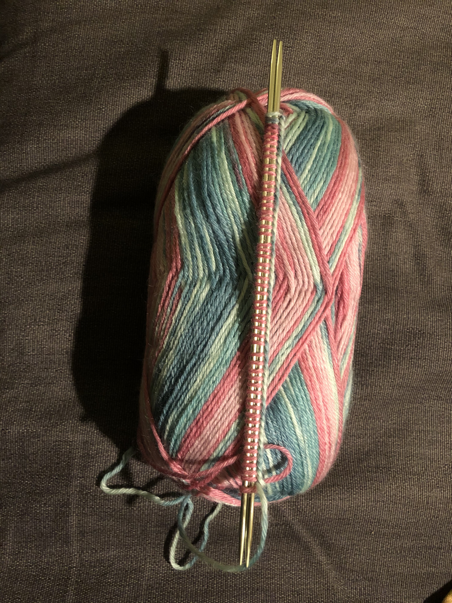
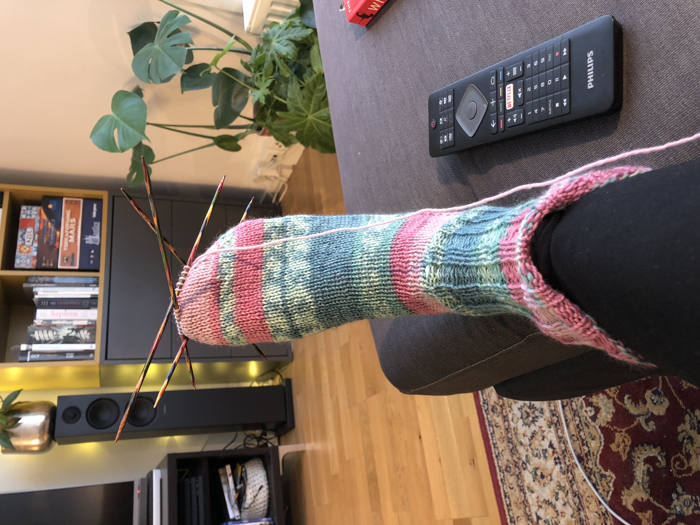
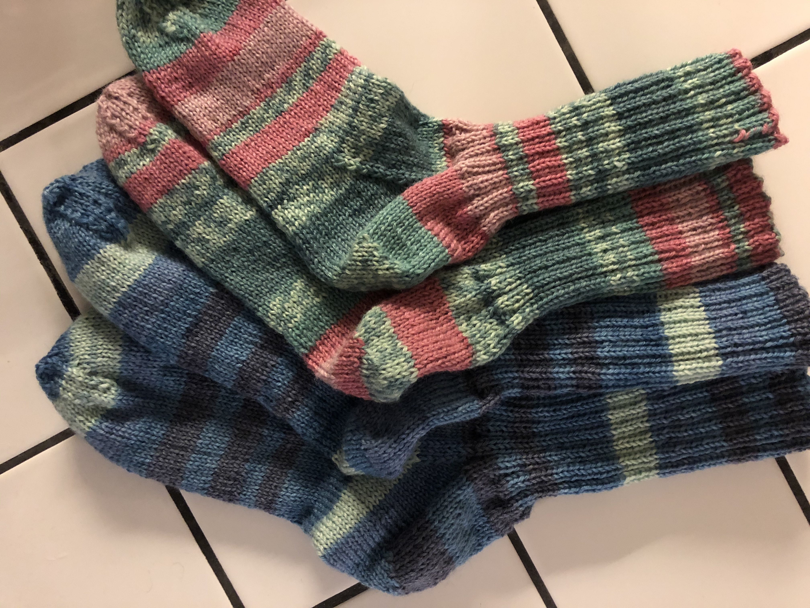

Julen 2020 beslutade jag att ge mamma och Kent var sitt par stickade sockar i julklapp, jag hade dock inte stickat dem än så dags att sätta igång. Tencel Raggi hade just kommit ut så jag beställde sånt och började sticka på de rosagröna i januari. Följde Järbos "Klassiska raggsockor i mellanraggi".

I April var alla sockar klara och redo att skickas norröver.

"Sämsta mönstret jag varit med om tror jag?" har jag skrivit i mina anteckningar. Låter hårt, här är några saker jag anmärkte på:

På minskningsvarv för tå tyckte jag minskningarna var på fel sticka, att de blev åt fel håll. Framtids-jag tänker jag att jag kanske missade att sticka 1 bytte plats? Allmän brasklapp för att jag kanske gjorde eller förstod fel, men irriterade var det iaf. 

Tips för framtida mig är att istället köra ssk (den där ena slip är avig och den andra är rät i någon ordning) både för tåminskning och för hälen (istället för i bakre maskbågen)

Jag ville inte ha den spetsiga näbbtå som mönstret ville, så jag slutade på 20 respektive 32 maskor. Slutade precis innan jag avslutade ett varv utan minskning. 

Var inte heller nöjd med avmaskningen i mönstret, så på par nummer två använde jag istället kitchener stitch. 

Alla besvikelser till trots så blev det sockar i alla fall! Mammas i storlek 38/39 (1 nystan) och Kents i storlek 42-43 (2 nystan). 

