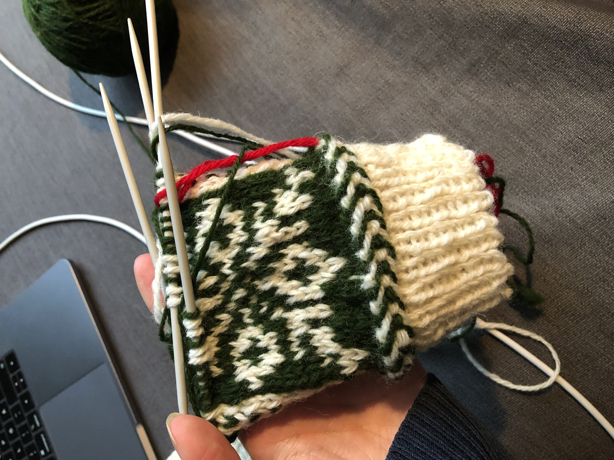
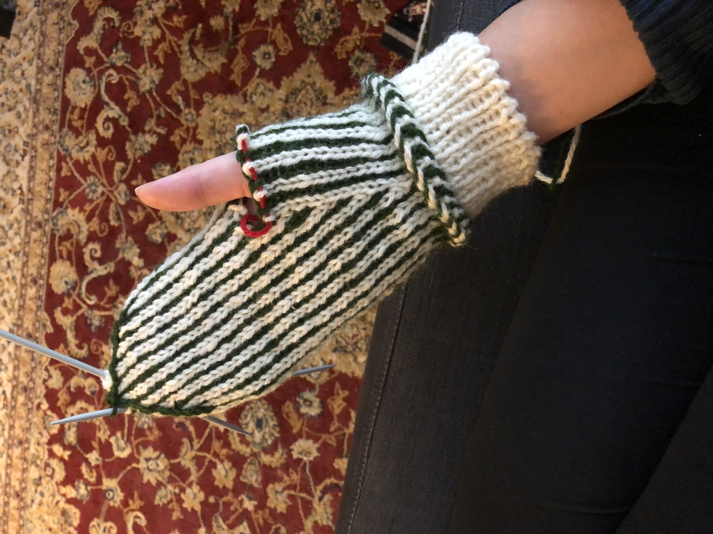
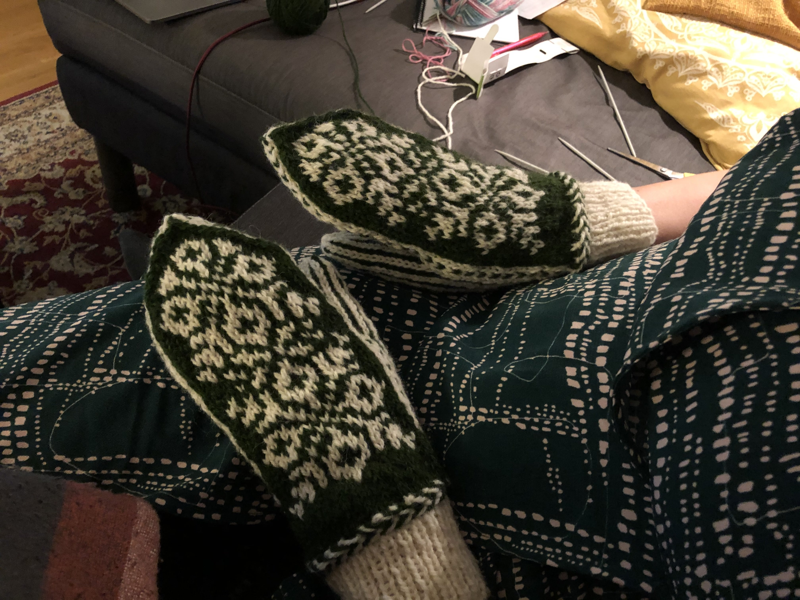
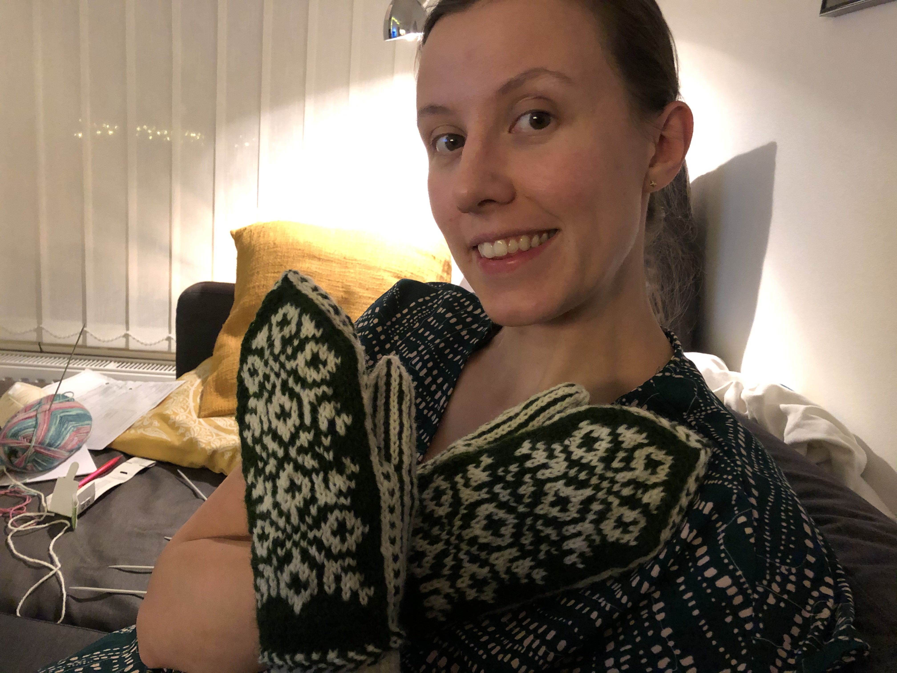
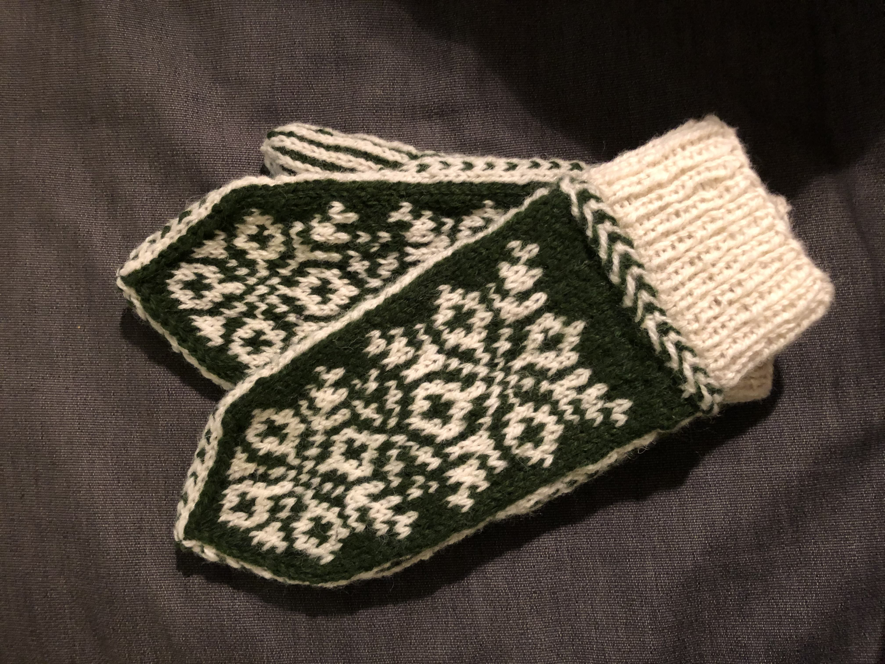

Wohoo ett första riktigt blogginlägg! Hittade de anteckningar jag gjort över modifieringarna jag 
gjorde för vantarna och tänkte att det är väl bara att ta tag i detta! So here I am!

Järbo har en tradition som heter Julvanten, och som nyfrälst stickare kändes konceptet med en liten
mysteriestickning spännande eftersom mönstret släpptes i 3 delar med 1-2 dagars mellanrum. Det som
gjorde mig mest pepp var kanske att det var en chans att använda deras nya garn "Svenskt ull",
kändes som en så fin produkt, svenskt ull i mysiga färger. Minns inte hela sales pitchen men
jag var såld!

Så jag beställde hem i skogsgrön (Pine Tree Green) och vit (Arctic Fox) och väntade på att första 
delen av mönstret skulle publiceras. Och på luciamorgonen körde jag igång, sen tappade jag fokus 
någon dag men 20 december såg det ut såhär:

Och 22 december blev jag typ klar med första vanten

Men den kändes liten för min inte minimala hand så...



...jag började om från början MED MINA MODIFIERINGAR!

Jag tyckte den var både tight i fingertopparna och smal så bestämde mig för att öka på båda 
fronterna, det var nog inte rätt beslut eftersom de kanske blev lite stora sen. Se kommentar längre ner.

Här är iaf de instruktioner jag utgick från:

lägg upp 48 maskor och sticka 1rm, 1 am-mudd på 2,5mm  

sen 1 varv räta i samma färg, fortsatt på 2,5mm  

lettisk fläta på 2,5mm  

flytta över maskorna till 3,5mm  

fr o m nu varv med grönt fram, randigt bak och vit bård på sidorna  

första varvet efter lettisk fläta ökar du med 4 maskor jämns fördelat  (1 - ökning - 11)   

sen några likadana varv utan ökning. jämför med högervanten hur långt (typ 4?) innan mönstret börjar  

i mönstret så är ökningen INTE på tummen utan efter, så tummen är fortsatt 12 maskor. och på 
framsidan är det en extra grön på var sida. Vid stickning av tummen ökade jag 2 extra maskor per 
sida. Så 22 istället för 18 maskor. Körde 2 varv av ihoptagning innan jag drog tråd genom sista 4-5 maskorna.

Slut på instruktioner. Kanske går att förstå? Minns det som att jag förstod när jag gjorde vante 2.

Kunde jag göra om ngt hade det varit att inte köra så många extra varv mellan lettisk fläta och 
mönstret på handryggen. Den ökade bredden gav ju ökad längd iom att fler minskningsvarv behövdes 
vid fingertopparna.

Slutresultatet blev iaf såhär och användes oväntat mycket under vintern!

Mycket nöjd med att det blev lite luft mellan mönstret och de vita sidorna!

Mönster:
https://pdfgen.jarbo.se/generate/create/92655/1/Julvanten%202020.pdf 
