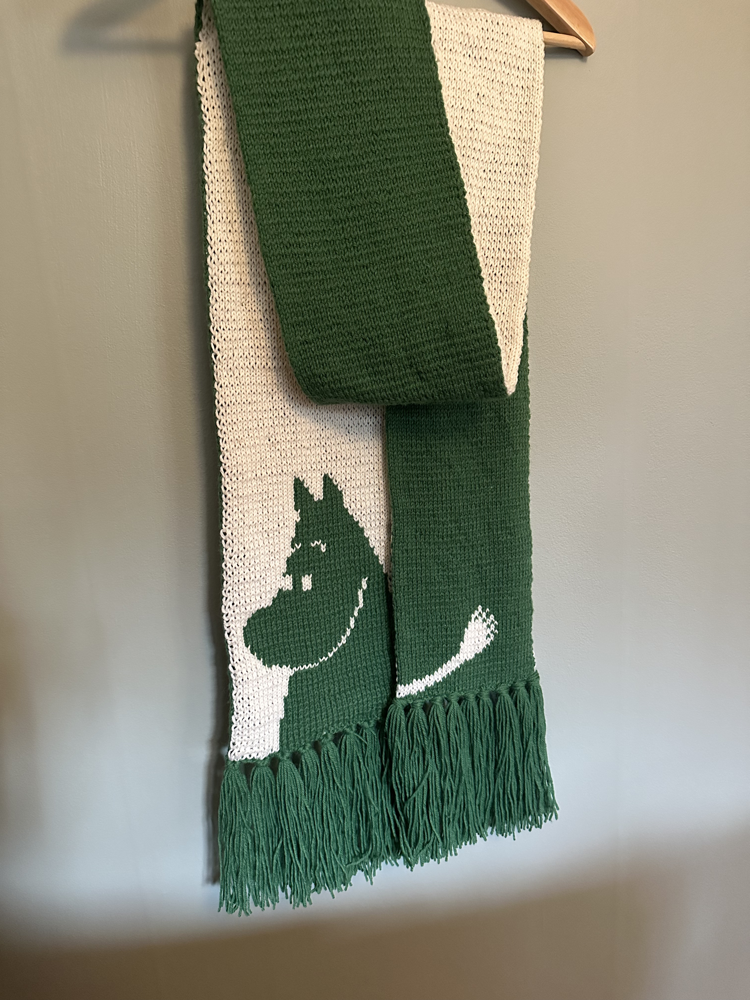

Hösten 2022 var jag uppe i Skellefteå, då berättade Ulla att hon fått garn och mönster till en halsduk och frågade om jag ville sticka den halsduken åt henne. "Dubbelstickning med flera färger, det har jag aldrig provat förut, så det klarar jag helt säkert!" hade jag kanske sagt om jag hade vetat att dubbelstickning fanns och att det hette just så. 

Jag tog med mig materialet söderöver och började försöka förstå mig på dubbelstickning och det tog några försök.

Började 2023-01-21, enligt anteckningar, men om det var när jag fattat grejen eller om det var när denna halsduk faktiskt fick sin första maska är oklart. För jag rev upp flera gånger för att jag gjort fel och för att jag inte kunde bestämma mig om jag skulle ta med handen eller inte. Är nu nöjd med att handen INTE fick vara med.

När jag var sjuk i oktober så blev halsduken till slut klar! Den är strax under 2 meter lång, lärdom är att inte underskatta hur lång tid dubbelstickning tar!

Tips på hur man ska hantera slut/början på rad: https://www.youtube.com/watch?v=PSNmGIIuZqo

Färgkombinationen Ulla fått från sina kollegor känns originell men då ska ni veta att en på internet redan testat: https://www.picuki.com/media/2005118236235944410  