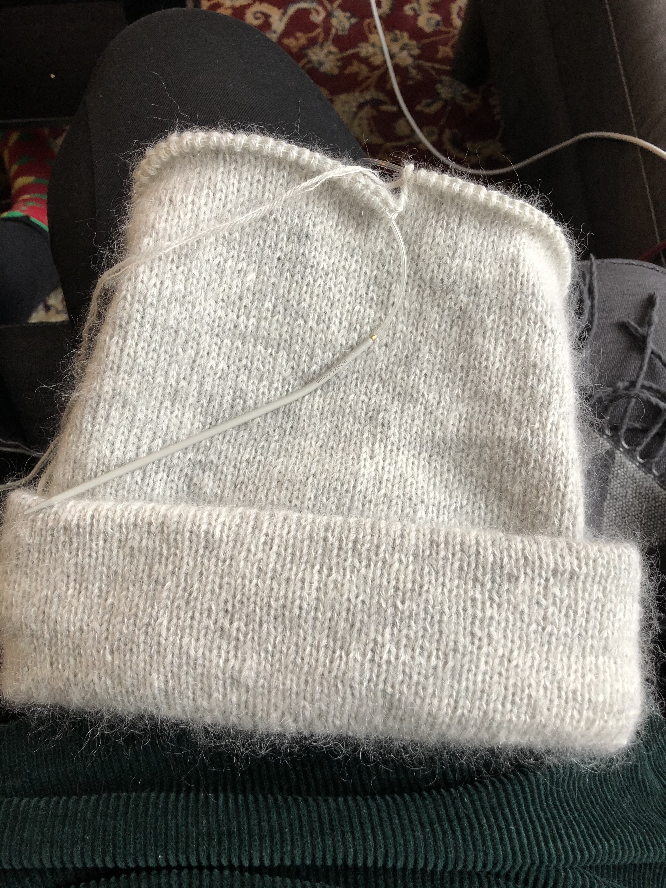
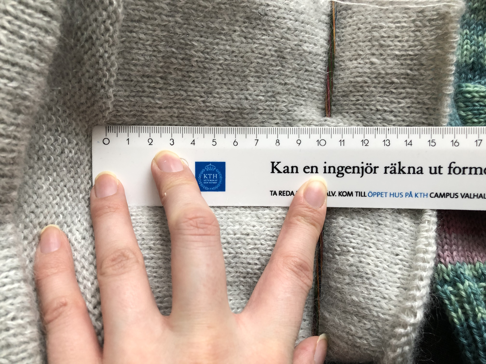
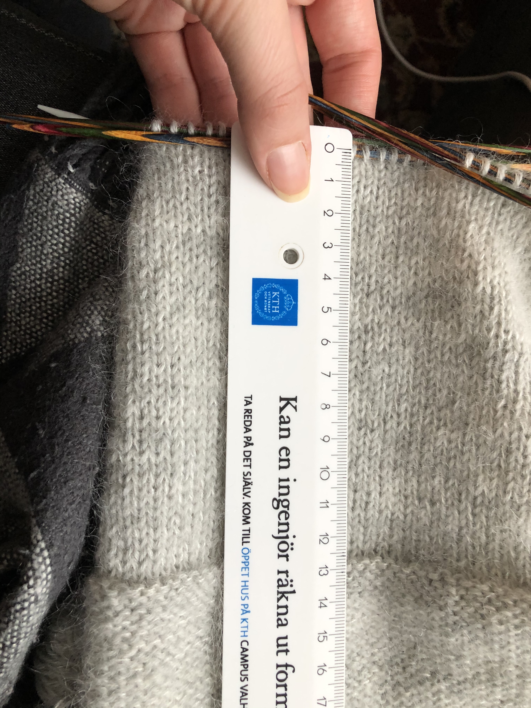
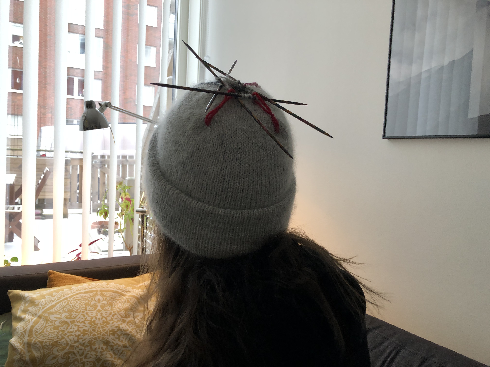
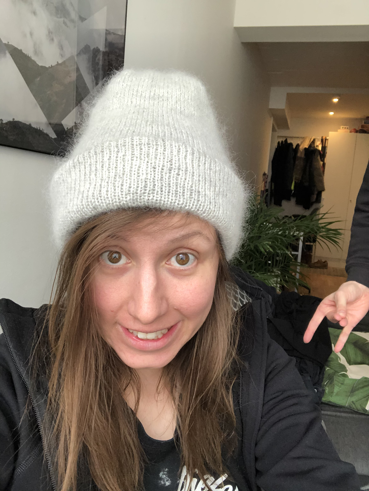

Denna historia börjar med att jag fått upp ögonen för PetiteKnits 
[Kontrasttröja](https://www.ravelry.com/patterns/library/contrast-sweater), specifikt den grågröna kombon.
Men innan jag skulle lägga hundratals (tusentals?) kronor på garn ställde jag mig den högst relevanta 
frågan: gillar jag mohair? Och det visste jag inte, så det kändes rimligt att ta reda på som första steg.

Tillvägagångssättet som jag valde för att ta reda på det blev att sticka 
[Oslomössan](https://www.petiteknit.com/products/oslomossan-mohair-edition?variant=13081419382839).
Tyckte mössan såg mycket fin ut och kändes spännande med mohair! 

Valde att efterlikna den grå versionen och köpte ett nystan Filcolana Arwetta Classic Very Light Grey och 
ett nystan Filcolana Tilia Natural White och körde sen igång!

Kanske inte körde igång sådär riktigt direkt. För visade sig att min kompis stickat exakt denna 
mössa för ett år sedan och att den blivit för liten! Så en viss rädsla uppstod att samma sak skulle
hända mig. Den var främst tight just i början av mössan, alltså under mudden så jag började lägga 
upp LÖSA maskor. 

Jag hade mätt mitt huvud med olika metoder och både själv och med hjälp och kommit fram till att 
Dam S skulle bli bra, lite marginal kanske till och med. Med huvudomfång dvs, inte i garnmängd då en
ynka storlek upp skulle kräva ett extra nystan per garntyp.

Det där med lösa maskor gjorde mössan mycket stor, så rev upp och la upp igen med mitt vanliga 
handlag. 



Men vänta... det är jättelite garn kvar. Och jag ska sticka massa mer. Fridge. Ett mätande påbörjades. 
Kommer garnet ens räcka? Överslagsräkningen sa "Absolut inte". Jocke hade redan anmärkt att han 
tyckte mössan blev väldigt hög. Tänkte först "hallå, det är så den ska va" men så började 
utforskning om mössan kanske kan få bli lite kortare, det skulle ju ha den tydliga fördelen att
det skulle bli en mössa till skillnad från ett pannband med uppvikt kant. 

Här blev det en stor paus i stickandet, beslut alltså. Varför sa ingen att stickning är så mycket 
beslut? Mätte och funderade och väntade, repeterade.



 
Så jag räknade hur många meter garn som var kvar och noterade "11 meter". Jag hade inte påbörjat 
minskningar än och ett varv tog 1,5 meter (enbart det faktumet var ju en chock?). Mina smarta anteckningar:
```
så 11 meter till att göra mössan längre
ett varv tar 1,5 meter (HOW?)
så kan typ sticka 6 varv? nä mindre
```

Räknade om lite och kom fram till 6 varv ändå med slutkommentaren `letsgoooo fingers crossed`, 
Upprivande påbörjades igen (men bara några cm) och tänkte att det blir ju mer stickning for 
the garnbuck om man river upp några gånger. Dåligt argument om fokus är på slutprodukten 
men bra om man mest vill sticka för att det är trevligt.

Minns inte hur det gick sen, rev upp några varv några gånger, varför? Har förträngt? Kom till slutet
iaf, tog kontrollbild:



Accepterade resultatet och stickade ihop och fäste. Nu var det ju bara mudden kvar... Eftersom 
mössans längd krympt typ 6 cm så behövdes mudden minskas. Nytt velande påbörjades, men dagar eller 
veckor(?) senare tog jag tag i det och satte upp mudden.

Det blev ärligt talat inte så bra, dels är uppvikningen ca 0,5 cm längre på ena sidan tror jag. 
Men främst är muddens rätsidan resten av mössans avsida och vice versa och jag
tog för lite marginal för att täcka avigsidan med vikningen, så den kan glida fram lite. Det skulle nog gå att fixa 
genom att fästa lite till, det ska jag nog göra.

Lärdomen är oavset: SE TILL ATT HA MARGINAL MED GARNMÄNGDEN!

Slutresultatet var svårfångat på bild (delvis pga den ljusa färgen).


PS. Inte nöjd med färgen heller, men nu vet jag att jag inte passar i ljusgrått! DS.
